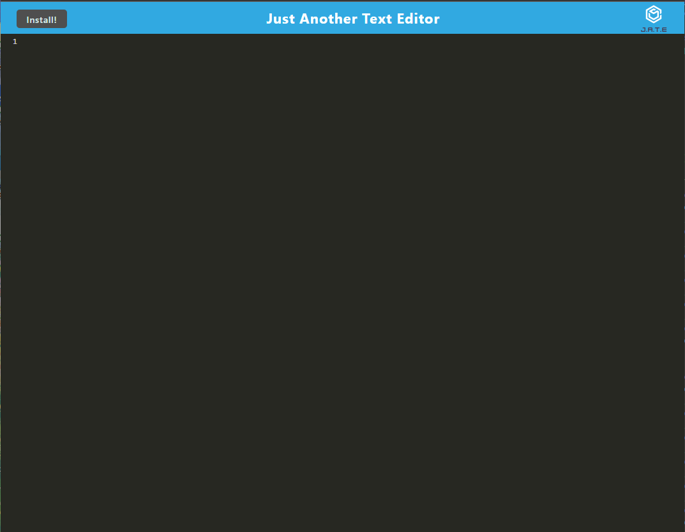

# Module 18 Social Network API

## Table of Contents
1. [Description](#description)
2. [Installation](#installation)
3. [Testing](#testing)
4. [Contribution](#contribution)
5. [Mock-Up](#mock-Up)
6. [Application](#application)
7. [License](#license)
8. [Contact](#contact)

## Description
For this application, we were tasked with building a text editor that runs in the browser. It is a single page application built to PWA criteria.
This application uses IndexedDB to store data.

## Installation
Install dependencies using ``` npm i ```. A list of the different script commands to use in the terminal can be seen in the ``` package.json ``` file. Use ``` npm run build ``` to build the application or simply ``` npm run start ``` to build and start the server all at once.

## Testing
No tests written for this project!

## Contribution
Currently not accepting contributions to the repo.


## Mock-Up
()


## License
Please see https://mit-license.org/ to get info about this license


## Contact
GitHub: https://www.github.com/jsadowski7
LinkedIn: https://www.linkedin.com/in/jake-sadowski-6b9385255/
